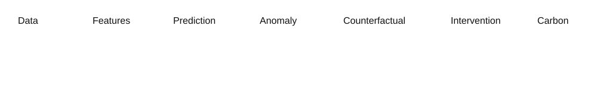

# AI-driven Building Energy Anomaly & Low-carbon Decision System

> **AI for building-energy diagnosis, anomaly detection, counterfactual screening and low-carbon decision support.**

## Why this project

Most building-energy analytics stops at prediction. This project closes more of the decision loop:

**prediction → anomaly detection → energy fingerprint → counterfactual → intervention screening → carbon scenario → field validation**

The objective is an auditable AI workflow that turns meter data into actionable hypotheses while separating model evidence from claims that require field measurement.

## System architecture



| Layer | Method | Output |
|---|---|---|
| Data | quality checks + education/electricity filtering | analysis-ready daily data |
| Prediction | ExtraTrees + lag/rolling features | expected energy use |
| Anomaly | rolling median + robust MAD | anomaly candidates |
| Fingerprint | persistence, recurrence, trend, morphology | building behavior type |
| Counterfactual | calibrated expected-use model | potential intervention signal |
| Intervention | fingerprint-to-action mapping | intervention family |
| Carbon | parameterized emission-factor scenario | conditional CO₂e |
| Validation | treatment/control + DID + placebo | field evidence |

## Model design

The project uses **strict chronological validation** rather than random splitting. Historical features are shifted before rolling calculations so future observations do not enter the feature set.

Across repeated rolling-window experiments on the public dataset:

- **R² ≈ 0.98**
- **WAPE ≈ 6–8%**
- ExtraTrees performed strongly among the tested tree models

Exact results depend on window, seed and subgroup. See [EXPERIMENTS.md](EXPERIMENTS.md).

## Data and evidence boundary

The pipeline is designed for a BDG2-derived daily building-energy dataset. Raw data are intentionally excluded from Git. Put the dataset at:

`data/test.csv`

The derivative dataset's exact `meter_reading` unit lineage must be verified before treating readings as kWh.

> **CO₂e values produced by this project are conditional scenarios until the energy unit and emission factor are independently verified.**

## Quick start

```bash
git clone https://github.com/SheepYang93/ai-building-lowcarbon-.git
cd ai-building-lowcarbon-
pip install -r requirements.txt
python scripts/run_v3.py --input data/test.csv --output outputs
streamlit run app/streamlit_app.py
```

Windows: `run_demo.bat`  
Linux/macOS: `bash run_demo.sh`

## Repository structure

```text
├── app/                 # Streamlit dashboard
├── data/                # Data instructions; raw data excluded
├── docs/                # Architecture diagram
├── scripts/             # Reproducible pipeline entry points
├── src/                 # Feature engineering, modeling, anomaly logic
├── tests/               # Automated tests
├── ARCHITECTURE.md      # System design
├── EXPERIMENTS.md       # Experiment record
├── RESUME_PROJECT.md    # Resume-ready description
└── FINAL_STATUS.md      # Evidence and limitations
```

## What makes it defensible

**Leakage control:** chronological evaluation and past-only lag/rolling features.

**Building-specific diagnosis:** contextual and temporal behavior are considered instead of one global threshold.

**Robust anomaly detection:** rolling baselines and robust dispersion reduce sensitivity to isolated extremes.

**Causal humility:** prediction is not causal effect. Counterfactual results are screening signals, not proof of savings.

**Explicit uncertainty:** unstable low-baseline cases are separated from candidates that survive robustness checks.

## What this project does NOT claim

- No measured campus energy savings.
- No measured CO₂ reduction.
- No assumption that every meter reading is verified kWh.
- Simulated intervention percentages are scenario assumptions, not engineering measurements.
- Public-data candidates are not automatically real campus buildings.

## Field-validation path

1. 8–12 week baseline
2. treatment/control selection
3. 4–8 week intervention
4. Difference-in-Differences (DID)
5. AI counterfactual comparison
6. placebo tests
7. measured energy and carbon accounting

## Portfolio positioning

This is an **AI + environmental engineering portfolio project** demonstrating Python/pandas/scikit-learn, time-series feature engineering, leakage-aware ML evaluation, anomaly detection, counterfactual reasoning, decision-support design, Streamlit productization and reproducibility.

See [RESUME_PROJECT.md](RESUME_PROJECT.md).

## License

MIT
