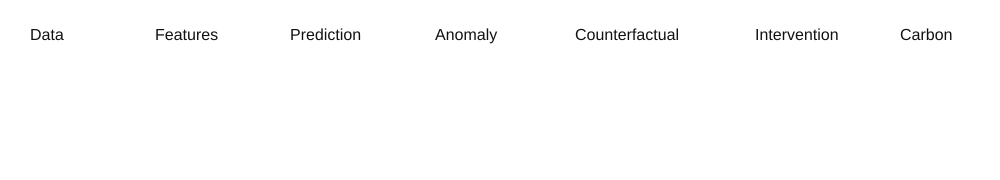

# AI-driven Building Energy Anomaly & Low-carbon Decision System

> **AI for building-energy diagnosis, anomaly detection, counterfactual screening and low-carbon decision support.**

**Live Demo:** https://ai-building-lowcarbon-production-e8b1.up.railway.app  
**Repository:** https://github.com/SheepYang93/ai-building-lowcarbon-

## 30-second overview

**Input:** daily building-energy data.

**AI workflow:** predict expected energy use → detect anomalies → build an energy fingerprint → screen counterfactual potential → map interventions → generate conditional carbon scenarios → validate with field data.

**Output:** a building diagnosis, intervention hypothesis, potential-saving signal, report, and a treatment/control validation workflow.

The system is designed as a decision-support prototype: model evidence is kept separate from claims that require field measurement.

## Why this project

Most building-energy analytics stops at prediction. This project closes more of the decision loop:

**prediction → anomaly detection → energy fingerprint → counterfactual → intervention screening → carbon scenario → field validation**

The objective is an auditable AI workflow that turns meter data into actionable hypotheses while separating model evidence from claims that require field measurement.

## System architecture



**Live product:** [Streamlit demo](https://ai-building-lowcarbon-production-e8b1.up.railway.app) · **Code:** [GitHub repository](https://github.com/SheepYang93/ai-building-lowcarbon-)

| Layer | Method | Output |
|---|---|---|
| Data | quality checks + energy-unit/data validation | analysis-ready daily data |
| Prediction | ExtraTrees + lag/rolling features | expected energy use |
| Anomaly | rolling median + robust MAD | anomaly candidates |
| Fingerprint | persistence, recurrence, trend, morphology | building behavior type |
| Counterfactual | calibrated expected-use model | potential intervention signal |
| Intervention | fingerprint-to-action mapping | intervention family |
| Carbon | parameterized emission-factor scenario | conditional CO₂e |
| Validation | treatment/control + DID + placebo | field evidence |

## Model design

The project uses **strict chronological validation** rather than random splitting. Historical features are shifted before rolling calculations so future observations do not enter the feature set.

Across repeated rolling-window experiments on the public dataset:

- **Example run:** R² ≈ 0.986, WAPE ≈ 5.9% on the included public-data derivative artifact
- The repository also records rolling-window robustness checks and subgroup sensitivity analysis
- Exact results vary by time window, seed, subgroup and data filtering; the included metric is an example artifact rather than a universal benchmark

See [EXPERIMENTS.md](EXPERIMENTS.md) for the evidence boundary and limitations.

## For a recruiter: what to look at first

If you only have one minute, open the **Live Demo** and then inspect these three files:

1. `app/streamlit_app.py` — the productized decision workflow and UI.
2. `src/` — feature engineering, modeling and diagnostic logic.
3. `EXPERIMENTS.md` — validation setup, repeated rolling-window results and limitations.

The project is intentionally presented as a **decision-support prototype**, not as a claim of measured energy or carbon savings.

## Tech stack

| Area | Stack |
|---|---|
| Data | Python, pandas, NumPy |
| ML | scikit-learn, ExtraTrees |
| Time series | lag/rolling features, chronological validation |
| Diagnostics | robust median/MAD, anomaly screening, energy fingerprint |
| Decision support | counterfactual screening, intervention mapping, scenario analysis |
| Product | Streamlit |
| Validation | treatment/control, DID, placebo tests |
| Engineering | Git, tests, reproducible scripts |

## Demo

The public Streamlit app demonstrates the full decision workflow and can be opened directly without installing the project:

1. **Overview** — system scope, evidence boundary and demo status
2. **Upload & Diagnose** — upload a single-building daily-energy CSV and run robust anomaly screening
3. **Building Diagnosis** — inspect anomaly share, temporal behavior and energy fingerprint
4. **Counterfactual** — view potential intervention signals as screening evidence
5. **Intervention** — map the fingerprint to an intervention family
6. **Carbon** — explore conditional carbon scenarios
7. **Report** — generate a downloadable Markdown diagnosis report
8. **Field Validation** — upload treatment/control data and calculate a basic Difference-in-Differences (DID) estimate

### Demo workflow

```text
Upload CSV
   ↓
Daily aggregation
   ↓
Past-only robust anomaly detection
   ↓
Energy fingerprint
   ↓
Counterfactual screening
   ↓
Intervention recommendation
   ↓
Download report
   ↓
Treatment / Control validation
   ↓
DID
```

When generated pipeline artifacts are unavailable, the app explicitly labels the displayed evidence as **Demo mode** rather than presenting it as a live retraining result.

## Data and evidence boundary

The pipeline is designed for a BDG2-derived daily building-energy dataset. Raw data are intentionally excluded from Git. Put the dataset at:

`data/test.csv`

The derivative dataset's exact `meter_reading` unit lineage must be verified before treating readings as kWh.

> **CO₂e values produced by this project are conditional scenarios until the energy unit and emission factor are independently verified.**

## Quick start

```bash
git clone https://github.com/SheepYang93/ai-building-lowcarbon-.git
cd ai-building-lowcarbon-
pip install -r requirements.txt
python scripts/run_v3.py --input data/test.csv --output outputs
streamlit run app/streamlit_app.py
```

Windows: `run_demo.bat`  
Linux/macOS: `bash run_demo.sh`

### Minimal demo CSV

A small example is included under `examples/`, so the UI can be understood without downloading the original public dataset. For your own data, the minimum required fields are:

```text
timestamp, electricity_kwh
2026-01-01, 1234.5
2026-01-02, 1188.2
```

The uploader also accepts common aliases such as `datetime`, `date`, `energy_kwh` and `energy`.

## Engineering and reproducibility

The repository keeps the distinction between **model evidence**, **screening hypotheses** and **field evidence** explicit. This matters because a good energy-AI portfolio should show not only that a model can predict, but also where its conclusions stop being experimentally verified.

The main validation design is chronological: historical lag/rolling features are shifted so future observations do not leak into the feature set. Field-effect claims are reserved for treatment/control data and DID-style validation.

## Repository structure

```text
├── app/                 # Streamlit dashboard
├── data/                # Data instructions; raw data excluded
├── docs/                # Architecture diagram
├── examples/            # Small public demo artifacts
├── scripts/             # Reproducible pipeline entry points
├── src/                 # Feature engineering, modeling, anomaly logic
├── tests/               # Automated tests
├── ARCHITECTURE.md      # System design
├── EXPERIMENTS.md       # Experiment record
├── RESUME_PROJECT.md    # Resume-ready description
└── FINAL_STATUS.md      # Evidence and limitations
```

## What makes it defensible

**Leakage control:** chronological evaluation and past-only lag/rolling features.

**Building-specific diagnosis:** contextual and temporal behavior are considered instead of one global threshold.

**Robust anomaly detection:** rolling baselines and robust dispersion reduce sensitivity to isolated extremes.

**Causal humility:** prediction is not causal effect. Counterfactual results are screening signals, not proof of savings.

**Explicit uncertainty:** unstable low-baseline cases are separated from candidates that survive robustness checks.

**Reproducibility:** the repository contains the pipeline code, tests, experiment record and small demo artifacts while excluding the large raw dataset.

## What this project does NOT claim

- No measured campus energy savings.
- No measured CO₂ reduction.
- No assumption that every meter reading is verified kWh.
- Simulated intervention percentages are scenario assumptions, not engineering measurements.
- Public-data candidates are not automatically real campus buildings.
- Counterfactual estimates are screening signals and require field validation before being interpreted as realized savings.

## Field-validation path

1. 8–12 week baseline
2. treatment/control selection
3. 4–8 week intervention
4. Difference-in-Differences (DID)
5. AI counterfactual comparison
6. placebo tests
7. measured energy and carbon accounting

## Portfolio positioning

This is an **AI + environmental engineering portfolio project** demonstrating Python/pandas/scikit-learn, time-series feature engineering, leakage-aware ML evaluation, anomaly detection, counterfactual reasoning, decision-support design, Streamlit productization and reproducibility.

See [RESUME_PROJECT.md](RESUME_PROJECT.md).

## Current demo status

The hosted Streamlit demo is deployed as a single production service on Railway. The repository remains the source of truth for the application code and reproducible local workflow.

## License

MIT
